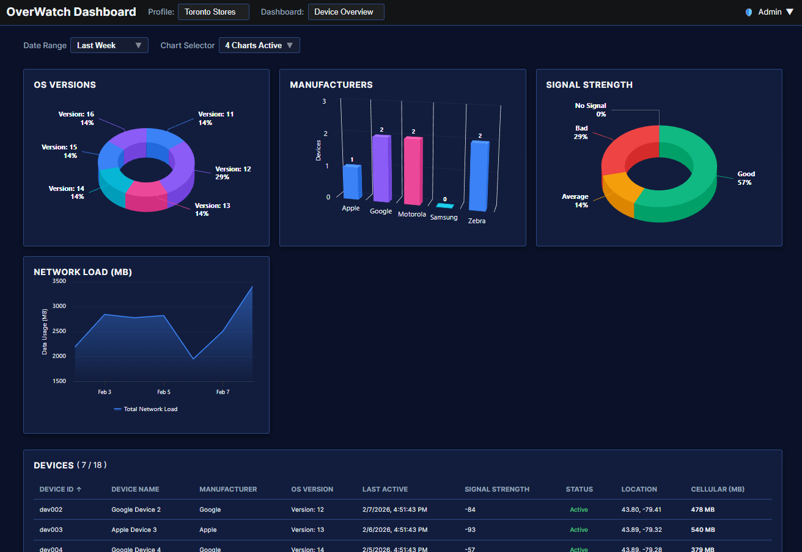
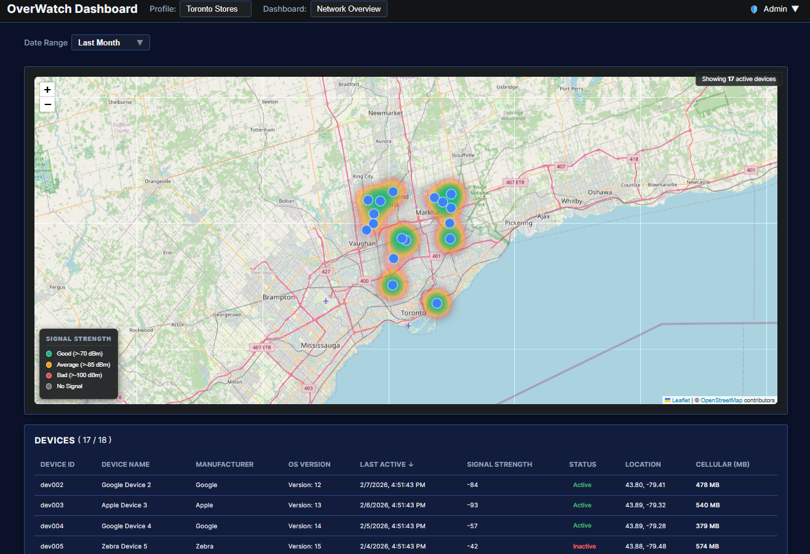
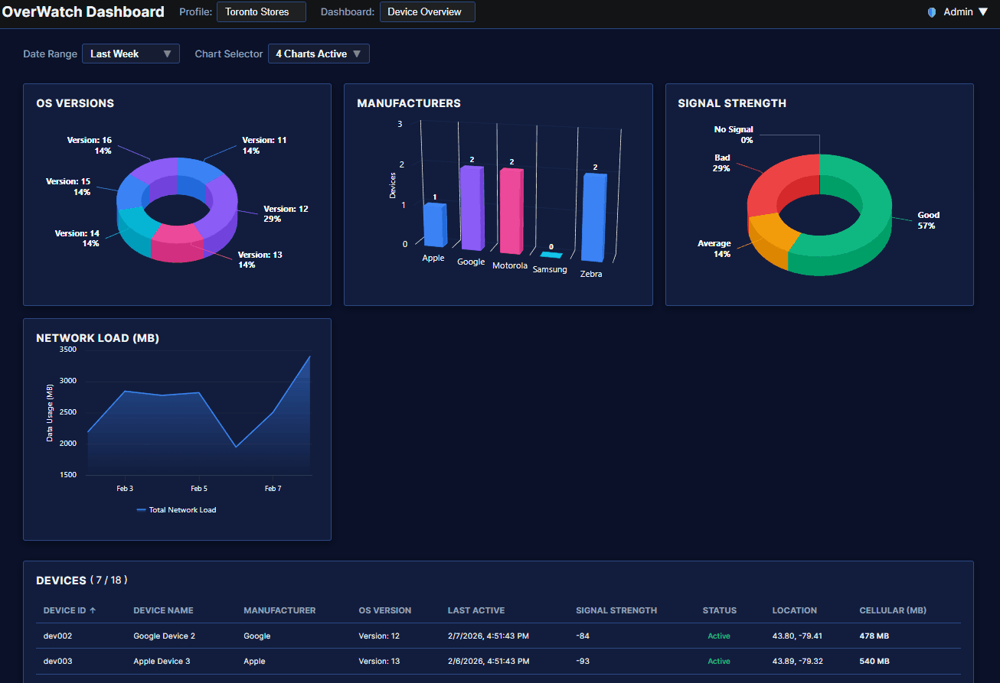

# 🛰️ Sapphire Network Sentinel

A high-performance **React + Vite** network monitoring dashboard. This project provides real-time visibility into device health, signal telemetry, and geographic distribution across the Greater Toronto Area.

## 🚀 Key Features

- **Toronto-Constrained Mapping**: Custom geospatial logic ensures all device markers remain on-land within Toronto city limits.
- **Signal Heatmap**: Dynamic heat gradients based on signal buckets: Good (>-70 dBm), Average (>-85 dBm), Bad (>-100 dBm), and No Signal.
- **Sapphire Dark Theme**: A consistent, high-contrast UI featuring glassmorphism popups and minimalist "anchor" chart headers.
- **Synchronized State**: Centralized `FilterContext` ensures that date ranges and device filters update the map and analytics simultaneously.

## 📸 Project Gallery

### Static Overviews

  
  

### Interactive Demos

  
  

---

## 🛠️ Tech Stack

- **Frontend**: React 18 (Vite)
- **Mapping**: React-Leaflet & Leaflet.heat
- **Charts**: Highcharts & Highcharts React
- **State**: React Context API
- **Styling**: CSS3 (Sapphire/Graphite Theme)

## 🏗️ Getting Started

npm install

Run Development Server:
npm run dev

Build for Production:
npm run build
